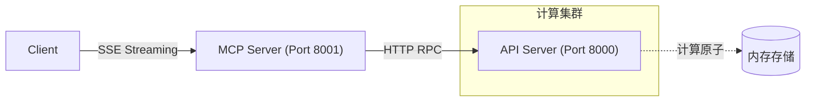

# MCP 学习项目⚡

[](https://www.python.org/)
[]()
[]()

## 🌟 项目简介
本项目是一个基于MCP协议的学习程序，提供了四则运算工具集，支持实时消息传输和异步HTTP客户端。

## 🌟 系统架构


## ✨ 核心功能

- 🧮 四则运算工具集（加减乘除）
- 📡 基于SSE的实时消息传输
- ⚡ 异步HTTP客户端支持
- 🔒 强类型输入校验
- 📊 支持多内容类型返回（文本/图片/嵌入式资源）

## 🛠️ 技术栈

- 框架: [Starlette](https://www.starlette.io/)
- 服务器: [Uvicorn](https://www.uvicorn.org/)
- HTTP客户端: [HTTPX](https://www.python-httpx.org/)
- 协议: [MCP Server-Sent Events](mcp-server-sse-docs)

## 🚀 快速开始

### 前置要求
- Python 3.10+
- Pipenv

```bash
# 安装依赖
pip install -r requirements.txt
```