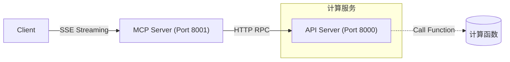

# MCP 学习项目⚡

[](https://www.python.org/)
[]()
[]()

## 🌟 项目简介
本项目是一个基于MCP协议的学习项目，主要用于学习MCP Server如何实现。
api_server目录内是一个使用FastAPI库实现的一组API服务接口，用来模拟现有系统的java后端服务，本项目内只是实现了加减乘除四则运算。
tests目录下是一个针对api_server的单元测试程序，用来熟悉pytest功能。
mcp_server目录下是mcp的server内容，包含mcp的两种实现方式
### 第一种是stdio方式
主要就是本地调用，本地运行的方式，主要实现包含在server.py代码中。
使用方式可以使用cline插件进行调用，下面附上cline调用的cfg配置
```bash
{
  "mcpServers": {
    "math": {
      "timeout": 60,
      "command": "mcp",
      "args": [
        "run",
        "\mcp_server\server.py"
      ],
      "transportType": "stdio",
      "disabled": true
    }
  }
}
```
#### stdio运行方式
```bash
#进入api_server目录下
python main.py
#启动api 服务

#配置好cline的cfg后
#在cline中测试mcp server
```


### 第二种是sse方式
使用uvicon生成一个服务，使用cline插件的remote server方式进行配置连接。
主要功能包含在remote_server.py中，下面附上cline的cfg配置
```bash
{
  "mcpServers": {
    "calculate": {
      "autoApprove": [
        "calculate_sum",
        "calculate_subtract",
        "calculate_multiply",
        "calculate_divide"
      ],
      "disabled": false,
      "timeout": 60,
      "url": "http://127.0.0.1:8001/sse",
      "transportType": "sse"
    }
  }
}
```
#### sse运行方式
```bash
#进入api_server目录下
python main.py
#启动api 服务

#进入mcp_server目录下
python remote_server.py
#启动mcp server

#配置好cline的cfg后
#在cline中测试mcp server
```


## 🌟 系统架构


## ✨ 核心功能

- 🧮 四则运算工具集（加减乘除）
- 📡 基于SSE的实时消息传输
- ⚡ 异步HTTP客户端支持
- 🔒 强类型输入校验
- 📊 支持多内容类型返回（文本/图片/嵌入式资源）

## 🛠️ 技术栈

- 框架: [Starlette](https://www.starlette.io/)
- 服务器: [Uvicorn](https://www.uvicorn.org/)
- HTTP客户端: [HTTPX](https://www.python-httpx.org/)
- 传输协议: [MCP Server-Sent Transports](https://modelcontextprotocol.io/docs/concepts/transports)

## 🚀 快速开始

### 前置要求
- Python 3.10+
- uv

```bash
# 安装依赖
pip install -r requirements.txt
```